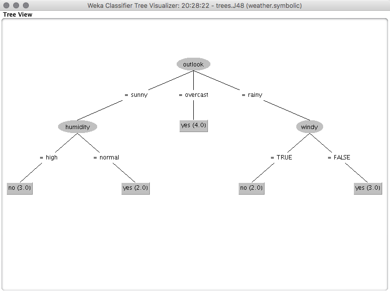
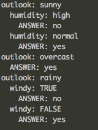
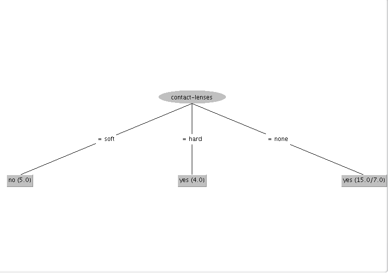
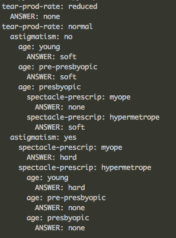

# Descicion trees report
#### Esteban Quintana A01184855 
#### Javier Rodríguez A01152572 

#### Explain the advantages and disadvantages of writing a program on your own vs using a pre-created suite such as WEKA.

|| Our implementation|WEKA|
|----               |----       |----                  |
| Time to implement | Long time | Quick implementation |
|Adaptability       |Can be easily implemented to solve many problems| Can hardly be used to recieve inputs to solve different kinds of problems and easily get the output|
|User-friendly|No interface, cannot be easily used by everyone| Interactive interface, quick understanding |

#### Explain what criteria you followed to choose the datasets for your tree and the WEKA tests.
We mainly used the example datasets that were provided, but further experimentation will be done for the final project.

#### Include the graphics of the trees or part of the trees you generated in WEKA and your own program. Are they different, and if so, why?
| Header One     | Header Two     |
| :------------- | :------------- |
|       |        |
|  |   |

They present the same results, but the logs from WEKA are more extensive an can provide a lot of information about how to purge your data to get better results form further iterations.

#### Based in what you have learned so far where would you use decision trees?  

  - Decision trees can be used in problems that has lots of data and you need to find patterns in it in order to predict what would happen given an input.
  - For example:
    - Netflix: To find the patterns in the movies that a person would like given the previous movies he watched.
    - The likehood of someone having cancer given the information about his genes.
